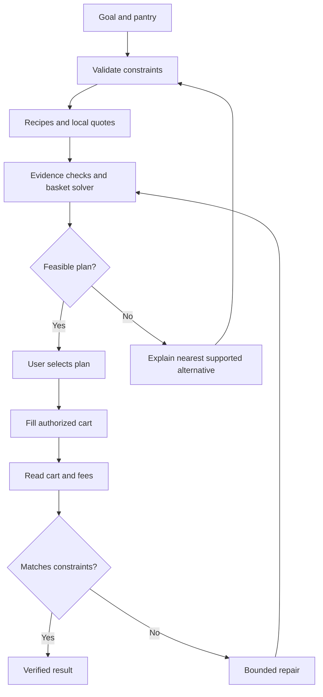

# DinnerGuard — Revised Architecture and Hackathon Assessment

Reviewed 11 September 2026. Working product name; no name-availability research performed.

This replaces the original Budget Nutrition Agent design with a narrower build specification. It is a proposed architecture, not an implemented or benchmarked system. The supplied capability audit was read alongside the original architecture. Current official documentation was checked; no authenticated Anakin calls, grocery sessions, cart writes, or monitor deliveries were executed in this review.

## 1. Decision

Do not build the original plan unchanged. Its strongest elements are whole-pack budgeting, pantry awareness, evidence, and verification. Its weakest elements are unproven grocery checkout access, generated nutrition reference data, too much discovery, and unsupported predictions about what judges will reward.

Build a bounded meal-budget agent that can recover when the shopping plan fails. The defining moment is a verified basket repair under the original constraints. Recipe recommendations, a slider, and a price alert support that moment.

**Pitch:** Tell DinnerGuard what you can spend and cook. It finds a feasible meal, prices the actual packs, builds the grocery cart, and repairs the plan if an item becomes unavailable or the total exceeds your budget.

The differentiated extension is two meals sharing one basket. This makes pack reuse real, rather than turning arbitrary leftover grams into invented future dinners. Ship it only after a single meal works end to end.

**Commitment gate:** allow a maximum of two hours for a grocery integration spike. If location-correct prices, authorized cart editing, and cart readback cannot be demonstrated, do not build three days of UI around that promise. Either deliberately ship a planning-only version with a lower action ceiling, or pivot to ReproAgent in §16. For a win-focused submission starting from zero, I favor the pivot over disguising product links as a filled cart.

## 2. What is actually known about the event

The organizer lists September 7–14, 2026 and emphasizes working agents that retrieve web information, reason through tasks, and perform useful actions. The inspected event page does not publish detailed judging weights, a submission cutoff timezone, or a requirement to use every Anakin product. [S1]

On September 11, that leaves roughly three calendar days to the listed end, not a fresh week. Verify the precise cutoff through the organizer's registration/submission information before scheduling the final build freeze.

My strategy inference: prioritize one legible problem, meaningful live-web dependence, a completed action, visible recovery, and inspectable evidence. This is an assessment of the brief, not an official scoring rubric or a guarantee of winning.

Delete claims such as “no other submission will have monitoring,” “auth scores zero,” and “judges don't run.” No evidence establishes them. Make the repository easy to inspect AND the application easy to run.

## 3. Audit of the original design

| Original choice | Problem | Replacement |
| --- | --- | --- |
| No delivery-fee modeling | A merchandise subtotal cannot certify a hard checkout budget. | Include observed checkout fees; otherwise mark the result provisional. |
| No delivery location | Prices and stock may belong to another fulfillment area. | Bind every quote and cart to a supported pincode and resolved store/session context. |
| LLM-generated nutrition, partly spot-checked | Correct arithmetic cannot repair an incorrect reference value. | A small sourced dataset with a record ID, food state, units, and source for every used entry. |
| Numeric sanity checks validate extraction | A plausible invented quantity can pass every range check. | Preserve exact recipe text and conversion provenance; validate evidence as well as range. |
| Protein target in the pitch, mostly soft ranking | A preferred dish can still miss the stated goal. | A strict mode makes the user-set per-meal target a constraint; show partial results separately. |
| Protein per rupee as headline ranking | It favors a ratio rather than completing the user's task; fully pantry-funded dishes divide by zero. | Feasibility first, then explicit preference and cost ordering. |
| Pantry as free/excluded ingredient tier | Ownership, purchase need, and nutritional contribution are separate facts. | Inventory quantity affects purchase cost only; consumed ingredients still contribute nutrition. |
| Oil excluded or assigned a universal dose | Energy depends on the actual recipe amount. | Parse supported quantities and include them; unresolved amounts prevent a complete energy claim. |
| “Two extra dinners” from remaining paneer | Other required ingredients may be exhausted. | Only claim another meal after proving its full ingredient allocation. |
| Rank dishes independently | Shared packs can change which combination is cheapest. | Aggregate requirements before purchasing packs; add two-meal enumeration after the single-meal loop works. |
| Packet bonus | A spice packet can cost more than spices already owned. | Let actual purchase requirements and method complexity decide. |
| Browser fallback “high confidence”; links “always work” | Neither a restored session nor a generic deep link proves a cart can be filled. | Capability-test each adapter; give each fallback an honest action state. |
| No database plus an overnight agent | Goals, monitor mappings, and event deduplication must survive restarts. | Small persistent store on durable storage; no consumer signup system required for the prototype. |
| Watch prices after the cart is finished | A later price drop may no longer help someone who already ordered. | Watch an unpurchased draft until an explicit expiry, then stop. |
| 25–30 recipe scrapes and a giant parsing batch | Expensive critical path; one slow result delays useful output. | Up to six new pages, two vetted domains, small extraction batches, a bounded candidate pool. |
| Geo price comparison | Country routing does not establish a comparable product, seller, currency, pack, or delivery location. | Spend that integration effort on local fulfillment correctness. |
| Raw/cooked correction in cut order | Cutting correctness invalidates the product's core number. | Reduce supported recipes/states, never silently remove the correction. |
| “Free” cache and monitoring | Background calls still consume credits. | Meter refreshes, monitored actions, retries, and browser sessions explicitly. |

## 4. Current Anakin findings that change the build

The published Blinkit catalog lists nine actions covering feeds, listings, search, and product detail. Its `bli_product_details` description accepts a pincode or coordinates and describes resolving a serving store. Several operations called “write” on the page merely describe retrieving listings or product details. The page lists no add-to-cart operation. [S2]

The published BigBasket catalog lists four operations: brands, categories, product detail, and search. It lists no cart operation, and the displayed search/detail parameter schemas do not establish delivery-location binding. [S3]

These are documentation findings, not evidence that a live action succeeds. Neither proves the absence of every possible cart integration. They do disprove treating a catalog's “write” badge as proof of cart support.

Use Wire Resolve to inspect a candidate action's real parameters, authentication mode, and credit cost. Then test its output against the intended task. [S4] Do not dynamically execute arbitrary discovered operations just to make a tool-selection animation impressive.

Browser Sessions persist state but introduce session lifecycle and concurrency requirements. [S5] Browser API is an execution surface for your controller, not a guarantee that a grocery site permits the desired workflow.

## 5. Product contract and scope

### Mandatory vertical slice

- One supported delivery area, visibly labelled.
- One retailer with an actually proven price and cart path.
- One person, one meal per run; budget is the total new expenditure for that basket.
- Vegetarian recipes using an induction stove and ordinary listed utensils.
- Approximately 20–30 source-backed ingredients and 6–8 validated recipe candidates at a time.
- User-set protein target per meal; nutrition displayed as a sourced estimate.
- Pantry quantities, including explicit confirmation of oil and other essentials.
- One recommended plan and at most two alternatives.
- One bounded cart repair, verified through an independent read of retailer state.
- Source details and a saved run record.

### Extension once that works

Two meals over the next 24 hours, with required storage availability recorded for recipes that need it. Both meals share one purchase budget and one pantry allocation. The protein constraint is per meal, not a total averaged across both. Do not expand into seven-day meal planning.

### Explicitly outside this build

Medical nutrition targets, micronutrient deficiency claims, weight-loss coaching, arbitrary equipment adaptation, restaurant macros, checkout payment, cross-border prices, multi-store split orders, subscriptions, accounts for every user, and autonomous purchases.

### Input semantics

| Input | Meaning |
| --- | --- |
| Budget | Maximum new checkout spend in INR for the selected meal horizon. |
| Protein | User-chosen grams per meal; strict or explicitly relaxed mode. |
| Pantry | Item, amount, unit, state, and whether it is sufficient for the requested meals. |
| Preferred ingredient | Soft preference unless the user marks it mandatory. |
| Equipment | Actual supported capabilities plus required utensils; not literal tag equality. |
| Dietary exclusions | Hard constraints; missing information stays unknown rather than approved. |
| Delivery context | Supported area and the resolved fulfillment/session context. |

“Induction” and “stove” are not always disjoint recipe capabilities. Normalize heat source, pan/pot, and any extra tools. A recipe that requires a blender does not become induction-only because its final step uses a pan.

## 6. Architecture

One controller coordinates retrieval workers, deterministic calculations, and a bounded repair policy. Parallel HTTP calls are workers; they do not require separate agent identities.

The loop has explicit limits. At most two repair attempts, a per-run credit ceiling, and a time deadline. A failed repair becomes an unresolved result with a concrete reason; it never spins indefinitely or quietly increases the user's budget.

The UI subscribes to persisted events. The same events support the run receipt and debugging. Local decision summaries explain actions without displaying hidden model reasoning.

## 7. Evidence and extraction

### Recipes

Use a small, vetted collection to ensure at least one useful run. Add live discovery when candidates cannot satisfy the goal or the user requests alternatives. Live inventory and prices already make Anakin materially necessary; re-reading unchanged recipes on every slider movement adds no value.

Prefer Recipe JSON-LD from fetched HTML, including ingredients, yield, instructions, and time. Schema.org supports those properties, but ingredient strings can still contain unstructured quantities. [S9] Structured markup is an extraction aid, not proof that the source is correct.

Use an LLM for unresolved text extraction and synonym proposals. Every normalized quantity retains:

- Exact original ingredient text and source URL.
- Recipe yield and the scaling factor applied.
- Amount, unit, and food state before conversion.
- Conversion record and normalized quantity.
- Validation status and reason for any exclusion.

Count units remain count units where appropriate. Cups need an ingredient-specific supported conversion; a universal grams-per-cup rule is invalid. Do not discard every count-based recipe just because eggs or packets are not stated in grams.

Support unambiguous raw quantities first. Add cooked quantities only when a matching record or a documented recipe-specific conversion is available. A single moisture multiplier is not a universal nutrient-retention model. Unknown state must not become a confident number.

### Nutrition

Use directly sourced manufacturer labels for matching branded products when available, and identified food-composition records for generic foods. FoodData Central documents food state, source metadata, portion weights, and underlying variability. [S10] Do not relabel a loosely similar food as an exact match; for example, a different cheese is not automatically paneer.

Start with protein and energy. Add other nutrients only when sourced and necessary. Store missing as null, never zero. The LLM may help locate or parse source data but cannot invent the reference values.

Display rounded estimates and their basis. Deterministic arithmetic provides reproducibility, not biological exactness. No claims about “closing an iron gap” from a single dinner or invented user requirements.

### Quotes

Use a product-level quote containing:

| Field | Purpose |
| --- | --- |
| Retailer, product ID, URL, variant | Exact purchasable identity. |
| Pack amount and unit | Valid purchase rounding. |
| Selling price and currency | Budget arithmetic; distinguish MRP and selling price. |
| Stock status and quantity limit | Unknown availability cannot certify feasibility. |
| Pincode, resolved store, session context | Prevent cross-location and personalized-price mixing. |
| Retrieval time, expiry, evidence ID | Freshness and auditability. |

Cache by retailer + fulfillment context + SKU + variant + relevant account context. Never reuse a generic “paneer price” across delivery locations. Search discovers candidates; a location-bound detail read or cart confirms shortlisted products where required.

## 8. Deterministic basket solver

Start with single-meal enumeration. For the two-meal extension, eight recipe candidates yield at most 36 unordered pairs including repeats when order does not matter. This is small enough to enumerate; no general mixed-integer solver is needed.

For ingredient i, using compatible canonical units and the purchase state:

    required_i = sum(quantity required by each selected meal)
    deficit_i = max(0, required_i - usable_pantry_i)
    packs_i = ceil(deficit_i / selected_pack_size_i)
    merchandise_total = sum(packs_i * selected_pack_price_i)
    payable_total = merchandise_total + observed_applicable_fees - verified_discounts

Combine quantities BEFORE rounding to packs. Pantry is consumed once across the whole plan. Zero purchase need is valid and never enters a division by cost.

Use integer paise for money. For each ingredient, consider a small bounded set of valid pack/SKU choices. Select the combination with the best actual payable cost under stock limits, not the lowest displayed price per gram. Limit the first release to one chosen SKU per ingredient; disclose that mixed-pack combinations are not exhaustively optimized.

Nutrition is calculated from the consumed allocation, including pantry ingredients. Use food-state-compatible records and, where material, the selected product's label. A cheaper SKU substitution can require recalculating nutrition.

Hard feasibility requires:

1. Every selected recipe is supported by its ingredients, method, equipment, and food-state evidence.
2. Required quantities can be obtained from pantry plus available packs.
3. Dietary restrictions and mandatory preferences are satisfied.
4. The estimated per-meal protein meets the user-set strict target under the documented calculation basis.
5. The applicable purchase total meets budget in the current location.

A pre-cart result with unknown fees is **provisional**, even if merchandise fits. A user-supplied fee allowance can support a planning estimate but cannot be called a retailer-verified payable total. If final fees appear only later, move the verification boundary there or qualify the promise.

Rank feasible plans lexicographically: preferred recipe/ingredient fit, then payable cost, then cooking effort, then unnecessary perishable remainder. Let the user choose “cheapest first” if wanted. Avoid arbitrary weighted nutrition scores and spice-packet bonuses.

Leftover quantities are inventory, not automatically waste or meals. Pantry staples remaining after dinner can be useful. Claim a second meal only if a full allocation proves it.

## 9. Budget frontier and honest alternatives

The slider recomputes over the same candidate pool and quote snapshot. No fresh API calls are needed until the user requests more discovery or quotes expire. Label the scope: “Among the recipes and products checked.” This is not a global optimum over the web.

If no plan qualifies, show one decision the user can make:

- The least additional budget required among checked complete plans.
- A different supported recipe if the preferred ingredient is flexible.
- A smaller explicitly selected meal horizon.

Never silently reduce the protein target, change a mandatory ingredient, omit a purchase, or use a subtotal as a payable total to create a green result.

For savings comparisons, hold location, servings, target, pantry, fee treatment, and time constant. Compare the proposed plan with a recorded baseline under those same constraints. Do not compare one meal against two or count the same pack saving twice.

## 10. Cart execution and recovery

There are three distinct outcomes, not interchangeable fallback claims:

| Adapter | Valid completion claim |
| --- | --- |
| Tested Wire cart operation | Items added to the retailer cart and verified by readback. |
| Tested Browser API + Session | Items added through the retailer interface and verified by readback. |
| Product links/shopping list | Purchase plan prepared; retailer cart has not been filled. |

Save a cart snapshot before mutation. Operate on a dedicated demo cart or explicitly tracked lines, preserve unrelated user items, and account for their effect on the actual payable total. Do not call a budget verified if the checkout being shown includes unaccounted items.

Each write is tied to a run ID, plan version, SKU, and desired quantity. Prefer setting quantities to a target over repeating additive clicks. On timeout, inspect the cart before retrying. The retailer may have accepted the first write.

Read product IDs, variants, quantities, line prices, fees, discounts, and total from retailer state after the write. A screenshot supports the evidence; a numeric field readback supplies the comparison. Do not reuse the planned total as the “verified” total.

When the cart does not satisfy the plan:

1. Refresh the affected quote or stock observation.
2. Try an approved equivalent SKU of the same ingredient, preserving units and recipe compatibility.
3. Recalculate the whole basket, including quantity tiers, nutrition, and fees.
4. If still infeasible, choose another validated recipe combination within the user's existing constraints.
5. Apply only changes within the user's chosen repair permission. Present a revised plan for selection when the change goes beyond that scope.
6. Read the result again; stop after two attempts or the run deadline.

This bounded choice among actions is the agent behavior. The calculator enforces constraints; the controller decides what additional information or alternative to pursue.

State labels: `planning`, `provisional`, `ready_for_selection`, `carting`, `repairing`, `verified`, `partial`, `blocked`, `expired`. “Seven of eight items added” is partial, not success. No payment is performed.

## 11. Optional persistence and monitoring

The useful goal is: keep this unpurchased draft feasible until the user's stated cutoff. A price or stock event invalidates a quote, the controller recomputes, and the application saves a new draft version plus a concise explanation.

Persist goals, plan versions, quotes, run events, monitor mappings, and a webhook inbox. SQLite on a durable volume is sufficient for one deployed process; use a persistent hosted database if the hosting model cannot preserve a local volume. No elaborate account system is required to demonstrate this in an isolated demo session.

Anakin Wire monitors execute one selected action with its parameters and compare structured results. They support watched JSON paths, a minimum 15-minute interval, and a Free active cap of five; actual check cost follows the chosen action, with an additional credit for optional AI filtering. [S6]

One arbitrary monitor does not watch an entire basket unless its selected action returns that basket's relevant products. For the prototype, watch one or two key SKUs or one proven multi-product response. Match results by product ID so search-result reordering is not mistaken for a price change.

For numeric price/stock changes, deterministic comparison is sufficient. Do not pay for `aiGoal` merely to describe subtraction.

Verify incoming webhook signatures, persist the event before acknowledging, deduplicate deliveries, and process asynchronously. Anakin documents signed asynchronous webhook events. [S7] Do not log session secrets. A browser session is serialized so simultaneous runs cannot corrupt the cart. Public demo visitors must not inherit the team's authenticated grocery account.

Replanning the application's saved draft can happen automatically. Revising a retailer cart needs the authorization scope described in §10. End the watch on expiry, cancellation, or user confirmation that the purchase is complete. Do not imply the application knows a payment happened unless it actually observes it.

Monitoring is a stretch feature. The core read–reason–act loop can already operate during a user-requested run. An overnight timestamp alone does not create useful autonomy.

## 12. Interface and demonstration

Use one large recommendation with three visibly different amounts: ingredients consumed, packs to purchase, and total payable. Keep the meal goal and protein estimate beside it. Put the retailer and quote time near the price.

For two meals, show both dishes drawing from the same purchased packs. Only render the second meal when the full allocation is valid. This is the visual explanation of why joint basket planning matters.

The center of the repair demo is a before/after difference:

    Original plan: one required item unavailable.
    Repair: equivalent product or supported alternative recipe selected.
    Result: same constraints checked, retailer total reread, cart complete.

Those are example states, not measured results. All rupee/protein values in the final video must come from an actual captured run.

Show short operational events such as “checked local stock,” “pack size changed,” and “cart total reread.” Keep raw action IDs, full rejected-page counts, and detailed source records in an expandable evidence panel. A long scrolling log should not compete with the result.

### Ninety-second edited walkthrough

| Time | Beat |
| --- | --- |
| 0–10 s | Concrete user constraint: budget, one meal, equipment, pantry. |
| 10–25 s | Show a retrieved recipe and the difference between used ingredient value and actual packs. |
| 25–45 s | Present the chosen complete basket and its source evidence. |
| 45–65 s | Show a real recorded failure or an explicitly labelled injected test failure. |
| 65–80 s | Controller repairs it; show the cart readback and satisfied constraints. |
| 80–90 s | Show the second-meal allocation if built, or the downloadable run receipt. |

Provide a separate uncut run with timestamps. Editing a walkthrough is fine; representing removed waiting time as measured latency is not. Do not stage a stock failure or overnight alert and present it as an organic retail event.

The slider is a short supporting interaction. A tiny budget adjustment does not need to be the climax. The more memorable story is that a broken plan became a usable result and the evidence is visible.

## 13. Latency and cost discipline

Use a maximum of two search queries and six new recipe pages. Process pages in batches of two or three; price accepted candidates incrementally. Render previews as previews. Never label them budget-qualified before the necessary prices and fees are known.

Targets, not measurements: first provisional result within 20 seconds; complete initial plan within 45 seconds; verified cart within 90 seconds. Collect actual p50, p95, completion rate, calls, and credits before making performance claims. Rate-limit responses and account concurrency determine the real budget.

Current pricing documentation lists Search at three credits, base scraping at one, optional JSON extraction at two additional credits per URL, and Starter at 300 credits. Wire costs vary by action. [S8]

The original estimate of roughly 38 credits omits scenarios already required elsewhere in its design. For example:

    2 searches × 3 = 6
    25 recipe scrapes with JSON × 3 = 75
    10 ingredient searches × 2 stores × 2 credits = 40
    subtotal = 121 credits

This is an illustrative configuration using documented two-credit grocery search actions, not a measured invoice. Product-detail reads, hot-cache refreshes, browser work, monitoring, and retries are extra. Without the JSON add-on the same example is 71 credits. Even the original 38-credit estimate multiplied by 20 cold runs is 760 credits, before background work.

Set per-run and daily ceilings from the actual account balance. Develop parsing, costing, and UI against recorded responses. Keep a labelled replay mode. Refresh only required products, and preserve valid recipe caches. Use an approved team allowance or event credits if available; the plan must not depend on repeatedly switching free accounts. Measure LLM input/output tokens separately rather than promising fractions of a cent without specifying the model and payload.

## 14. Build schedule and gates

| Window | Concrete exit criterion |
| --- | --- |
| First 2 hours | For one delivery area: three products with exact packs and stock; authorized add/change of cart quantities; independent cart and fee readback; restored session. Record the evidence. |
| Rest of day 1 | One source-backed recipe produces a costed plan and verified cart. A basic result screen displays actual data. |
| Day 2 first half | Deterministic quantity/pack tests, bounded alternative selection, one repaired failure, clear partial/blocked states. |
| Day 2 second half | Add two-meal enumeration only if the core is stable. Then slider, evidence polish, and optional pending-draft monitor. |
| Final day | Freeze features. Run acceptance scenarios, record an early backup demo, finish README, demo video, and uncut evidence. |

UI work may proceed with labelled fixtures after the first integration gate. It should not consume the first three hours while the project's defining external write is still hypothetical.

Cut in this order: geo and micronutrients (already removed), second store, broad recipe discovery, monitor, two-meal extension, extra UI variants. Preserve source provenance, raw/cooked correctness, all required purchases, complete-cart verification, and honest states.

## 15. Acceptance evidence

These are planned tests, not results from this review.

| Scenario | Pass condition |
| --- | --- |
| Ordinary feasible meal | Source quantities, packs, local SKU identities, nutrient estimate, and retailer total reconcile. |
| Whole-pack trap | A cheap consumed portion cannot pass when the required pack pushes checkout over budget. |
| Pantry sufficient | Purchase cost can be zero without a ratio/division failure; nutrition remains counted. |
| Partial pantry | Only the missing quantity is purchased, with pack rounding. |
| Two meals share ingredients | Pantry and packs are allocated once; no ingredient is promised twice. |
| Ambiguous state or unit | Recipe is rejected or explicitly unresolved; no invented conversion enters a verified result. |
| Location changes | Prior location quotes are invalidated. |
| Fees unknown | Result remains provisional. |
| SKU unavailable | Controller repairs within scope or ends blocked; no false complete-cart badge. |
| Write timeout | Cart is reread before retry; no duplicate additive purchase. |
| Duplicate webhook | One input event does not produce duplicate repairs or notifications. |
| Existing cart content | Unrelated items survive; actual budget interpretation remains explicit. |

Use manually reconciled golden baskets as an independent oracle for deterministic tests. Save source snapshots and raw retailer readback so expected values are not generated by the same code under test. Report tested denominators: for example, the count of attempts completed under original constraints, plus the count blocked honestly. Do not publish an invented reliability percentage.

For judging, include a short README, a clear demo, actual run receipts, measured limitations, and a replay command that needs no retailer login. The replay must visibly identify its captured date and source. Live execution remains a separately documented path.

## 16. Alternative if the grocery gate fails

### ReproAgent — strongest fallback for controlled execution

**Premise:** Give it a URL for your authorized staging app and a user-reported failure. It explores the relevant flow through Anakin Browser API, gathers observations, saves a minimal reproduction with a recording, and reruns the sequence in a fresh session.

Example demonstration: a coupon appears valid, but the payable total does not change. The controller tries the reported interaction, inspects UI and request/console evidence, narrows the steps, and produces a reproducible report. Use a deliberately seeded staging bug, clearly labelled as such. Do not invent a customer incident.

Ship one app, one supported family of interactions, a recording, reproduction steps, and fresh-session verification. Automatic code repair, broad production access, and claims about arbitrary websites are outside scope. The useful action is an executable verified reproduction saved to a controlled workspace; external issue creation is optional and authorized separately.

This has a higher technical-demo ceiling in my assessment because the controller can reproduce and verify a failure in a system you control. It also avoids unknown grocery login and fulfillment behavior. Its risks are a crowded general idea category and weak agent behavior if every click is hardcoded. The differentiator must be evidence-guided exploration and a replay that succeeds, not the mere existence of a browser recording. Anakin's audit and current API reference support the underlying browser/session/recording surfaces; successful execution still requires a spike. [S5, S11]

| Choice | Advantage | Main risk | Decision |
| --- | --- | --- | --- |
| Original nutrition agent | Relatable problem and attractive output | Too many assumptions; action can collapse into links | Do not build unchanged. |
| DinnerGuard | Clear consumer outcome and visible budget repair | Grocery execution and accurate input data | Continue if the two-hour integration gate passes. |
| ReproAgent | Controlled environment and verifiable technical result | Must demonstrate adaptive exploration | Prefer if starting from zero and grocery access fails. |

No concept guarantees a prize. Choose based on the strongest result you can actually demonstrate before the cutoff, not the longest list of APIs.

## Sources checked

All web sources below were inspected during this review on 11 September 2026. Statements about capabilities remain documentation claims unless explicitly described as executed.

- S1 — [Official Anakin Forge event page](https://anakin.io/hackathon/anakin-forge)
- S2 — [Anakin Blinkit catalog](https://anakin.io/catalog/blinkit)
- S3 — [Anakin BigBasket catalog](https://anakin.io/catalog/bigbasket)
- S4 — [Wire Resolve reference](https://anakin.io/docs/api-reference/wire/search-actions)
- S5 — [Browser saved sessions](https://anakin.io/docs/api-reference/browser-api/saved-sessions)
- S6 — [Wire monitors](https://anakin.io/docs/api-reference/monitoring/wire-monitors)
- S7 — [API reference: signed webhooks and endpoint index](https://anakin.io/docs/api-reference)
- S8 — [Pricing and credits](https://anakin.io/docs/documentation/pricing)
- S9 — [Schema.org Recipe](https://schema.org/Recipe)
- S10 — [USDA FoodData Central Foundation Foods documentation](https://fdc.nal.usda.gov/Foundation_Foods_Documentation/)
- S11 — [Anakin API reference: browser, recording, and session surfaces](https://anakin.io/docs/api-reference)

Original inputs: ARCHITECTURE.md and anakin-capability-audit(1).md supplied by the user. The original architecture's claims are the object of this review, not independent evidence.
